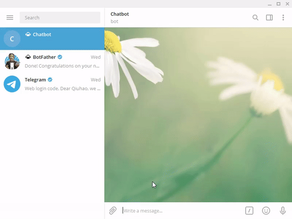

# SlookBot
SlookBot is a stock Chatbot allows user look up stock market via telegram.By sending message to the stock ticker and the values you want you look up, Slokbot will reply with the requisted informatin.Slookbot so far enables user to look up Stock Price, Market Value and Market volume. 

##Notice
Please use the correct ticker of the coperation. The progame is not capable of searching stock ticker with given company's name for now. I'll try to encoporate this function in the future.

##Demo
Here's a simple demo of the chatbot: https://youtu.be/l8eGagzQpdY



## Getting Started
To use the programe, download all the files in the folder. Run the Slookbot.py in the folder.
Search @Slookbot on telegram. And you can start chatting with SlookBot
The URL and token for Telegram are all personalized, change if needed.

### Installing

Several packages are used in Slookbot, including spacy, rasa_nlu
to install them

```
pip install rasa_nlu
```
```
pip install -U spacy
```
More information can be found :
rasa: https://legacy-docs.rasa.com/docs/nlu/0.11.4/installation/
spacy: https://spacy.io/usage/
iexfinance: https://pypi.org/project/iexfinance/

API database used here is IEXfinance.
To install inexfinance:

```
pip install iexfinance
```

###Intent recognition through rasa_nlu training model

The trainning model used in rasa_nlu is made from Chatito DSL: https://rodrigopivi.github.io/Chatito/

```
trainer = Trainer(config.load("config_spacy.yml"))
training_data = load_data('testing_dataset.json')
interpreter = trainer.train(training_data)
```
Trainning model is in the folder. 

### Entity recognition through regular expression
Entity recognition is achieved through regular expression.

```
ticker = None
ticker_pattern = re.compile("[A-Z]{3,}")
ticker = ticker_pattern.findall(message)
```

When several Capital letters appears in the message, Slooker will recognize it as stock ticker, such as AAPL,GOOG, etc.
